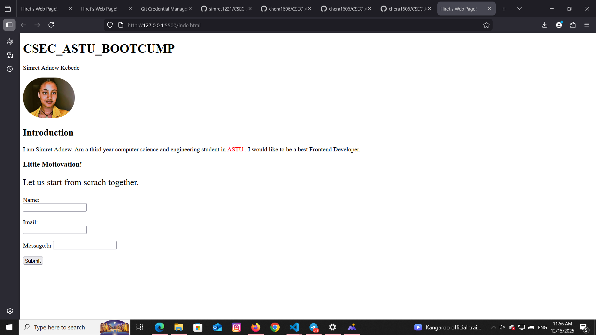

# CSEC ASTU MINI PROJECT 1

**Mini Project:** HTML & JavaScript Contact Form  

## Description
<<<<<<< HEAD
A simple contact form project with JS validation and alert messages.
=======
This is a simple contact form project created as part of the CSEC ASTU Dev Bootcamp.  
The form collects a user's Name, Email, and Message and uses JavaScript for basic validation and alert messages on submission.
>>>>>>> 4e9db82677fd0ab9e3dd616f6a9e6ff139434c04

## Features
- Name input
- Email input
- Message textarea
- Submit button with alert and validation

<<<<<<< HEAD
## Screenshot

=======
## How it works
- User enters their Name, Email, and Message.
- If any field is empty, an alert will ask the user to fill all fields.
- Upon successful input, a confirmation alert is shown.
>>>>>>> 4e9db82677fd0ab9e3dd616f6a9e6ff139434c04

## Live Demo
[View Live Demo](https://simret1221.github.io/CSEC_ASTU_BOOTCUMP_FIRST_MINI_PROJECT/)

<<<<<<< HEAD
=======
## Screenshot
  
*(Replace `screenshot.png` with your actual screenshot file if you want a visual preview.)*

>>>>>>> 4e9db82677fd0ab9e3dd616f6a9e6ff139434c04
## GitHub Repo
[Source Code](https://github.com/simret1221/CSEC_ASTU_BOOTCUMP_FIRST_MINI_PROJECT)
